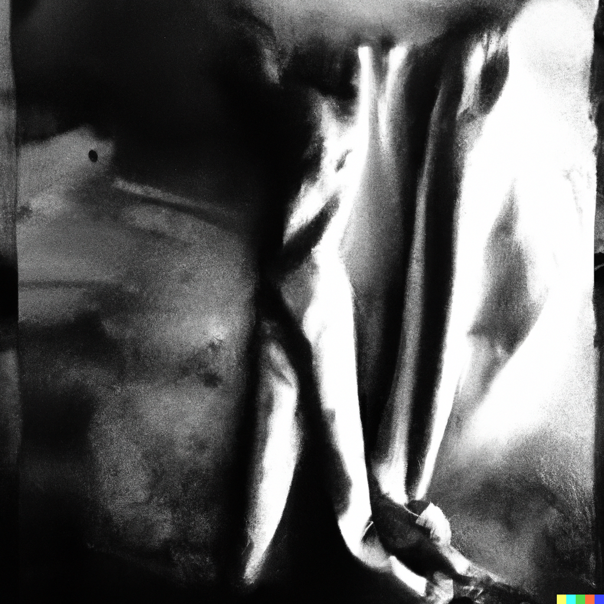
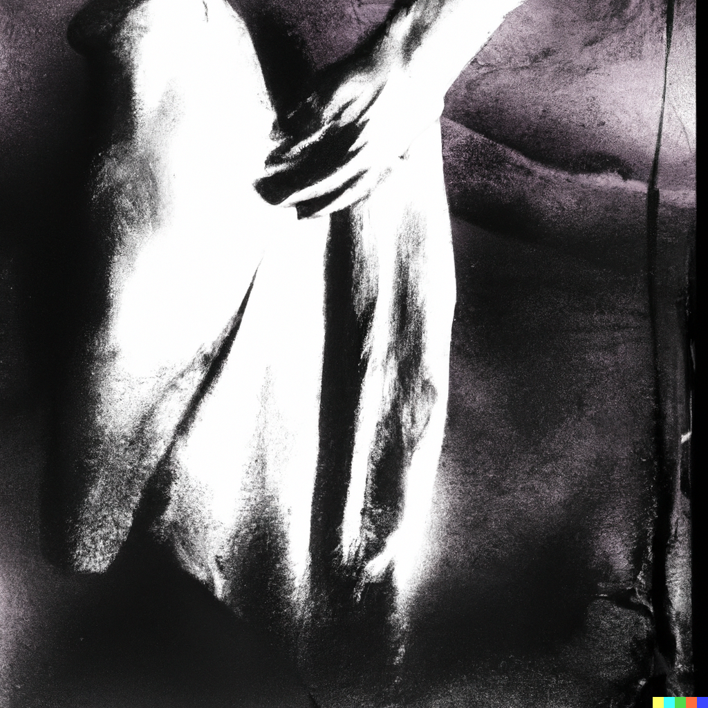
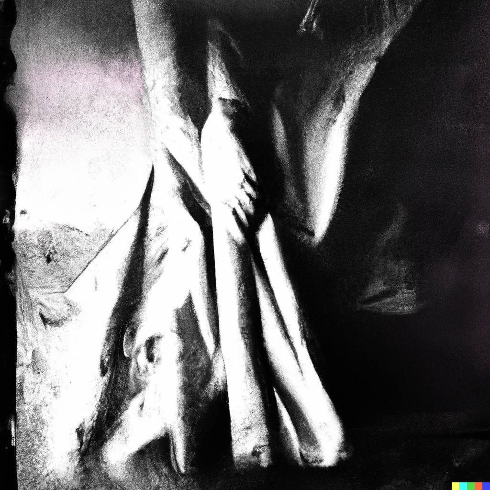

# Break 4/5

Note: shock (air)
Chakra: Samsara (https://www.notion.so/Samsara-268a56f93c9e4021975d0f56edf38b0c?pvs=21)
Mantra: CACAO
Aura: white
Element: Light (https://www.notion.so/Light-268af1d80e4f4936894aeca343bdd1ef?pvs=21)
Bagua: Yang ⚊ Light (https://www.notion.so/Yang-Light-d29d2f644b8c4952acfef3766a3d1f44?pvs=21)
Sense: https://www.notion.so/b4501003853c4d2094dd3ac7af0d9152, https://www.notion.so/f47ee029a0df433cacc822dc056ce2f9
Hermetic Principle: Chirality (https://www.notion.so/Chirality-ee5e8788c16943f4a4e8f8c7d565183c?pvs=21), Polarity (https://www.notion.so/Polarity-b4b62effd7434f2eaef403fd1f7f34da?pvs=21)
Loveforms: Eudaimonia (https://www.notion.so/Eudaimonia-b1e50399f05f405abea7339b3ba1f6cf?pvs=21)
Loveform (Greek): εὐδαιμονία
Intent: improve
Numerology: aspire
Theme: shock
Quality: pity
Aspect: separation
Act: shock
Modes of Persuasion: logos, pathos
Money stage: https://www.notion.so/d398d051ab75417ea838ff9c227b5b66
Order: 5
Major Arcana: The Devil (https://www.notion.so/The-Devil-46d61882f1f94c41a83ee9776712a6af?pvs=21), The Tower (https://www.notion.so/The-Tower-3d7c22622765452c8bb2c1a5df09155c?pvs=21)
Tarot Astrological Entities: https://www.notion.so/ae36ae94c9624b34a23fb2bdee22d916,https://www.notion.so/9a989c4af9c344c49d9a28ed46e9c7ea
Tarot Elements: Earth,Fire
Tarot Themes: bondage, materialism, oppression, excess,chaos, disruption, upheaval, disaster, catastrophe, shock
Dimension: 8-D (https://www.notion.so/8-D-57f4d9b9d9bb4023a3aac177977b0317?pvs=21)
Diment: choice
Realm: para
Early Season: Spring,Winter
Early Direction: Center
Later Season: Spring,Summer
Late Direction: Center
Stories of Deep Well: Anu, Chapter 5 (https://www.notion.so/Anu-Chapter-5-889fcb1491394052abc5e808b1f9c023?pvs=21), Oli, Chapter 5 (https://www.notion.so/Oli-Chapter-5-48d69a959661442c819ce1b29cb6f547?pvs=21), Sol, Chapter 5 (https://www.notion.so/Sol-Chapter-5-79877ff9193a477dad7d0d0f28363a9f?pvs=21), Fight for Earth (https://www.notion.so/Fight-for-Earth-17f2ddb8813980c1ab06ef1c79c02e42?pvs=21)
Previous step: Step 4 (Step%204%2091828741a5bd427abd83dd79ab59de30.md)
Next step: Step 5 (Step%205%20ad67951735a34009b12e2edf3cd65a32.md)
Dimensional Trinities: Transcendence (https://www.notion.so/Transcendence-1a52ddb8813980eb96dbe4cc9e4f6a0e?pvs=21)
Rollup: https://www.notion.so/1aba0273c7cc497b8ffc21c26ae4e684,https://www.notion.so/5ec2a1dac9f142469dfcfb6ddc4e309b
Sacred Bodies: Causal body (https://www.notion.so/Causal-body-1a52ddb8813980b1adcaf96818331769?pvs=21)
Timespace: Epsilon ε time (https://www.notion.so/Epsilon-time-b4eb7d23cc8444d79b619ee6c48e767f?pvs=21)
Vedic direction: Nadir
Vedic pantheon: Vishnu (https://www.notion.so/Vishnu-dff804070d534807920cc519a4e9a322?pvs=21)

- Contents
    
    

> 🌰 **In a nutshell**
> 

## Poetics

There has got to be more than this, this fetid humdrum beat, this wobbly downward spiral, this cursed swollen moment. Pop! A pinprick through the tense atmosphere, and the balloon never was. False boundaries hold us back, but we can feel the shock of their violation, like the apologetic tack of ersatz ermine, or the stuffed cling of pleather pants. The scab scraped away, taut pink nubility courses with the power of vulnerability.

## Aesthetics

Tough, dry, hardened exterior splits to reveal the softer, rejuvenated, next iteration within

## Theatrics

- Teeth falling out, or losing hair or nails, giving them a burial
- Live lobster sushi, or being eaten alive
- Losing a limb or companion and moving on in the moment

> **🦆 Qualities**
> 

## Narrator

A witness from the world beyond suffering

A superego for the soul we share

## Tone

Cold, impartial, matter-of-fact. Confident that this too shall pass

## Themes

- Crossing the threshold
- False boundaries a.k.a. barriers
- Storing up grief
- [Examples of Technological Devolution](https://www.notion.so/Examples-of-Technological-Devolution-45800270e0964884b66dc3552c55c8b5?pvs=21)
- [Day 10 - Effort: Grit to Surrender](https://www.notion.so/Day-10-Effort-Grit-to-Surrender-f100cae347934842bceb77fb8a27a8eb?pvs=21)
- [Loss](https://www.notion.so/Loss-d398d051ab75417ea838ff9c227b5b66?pvs=21)

## Symbols

- tree bark peeling
- skin molting or shedding
- hair cuts, shaving
- apoplexy? stroking out

