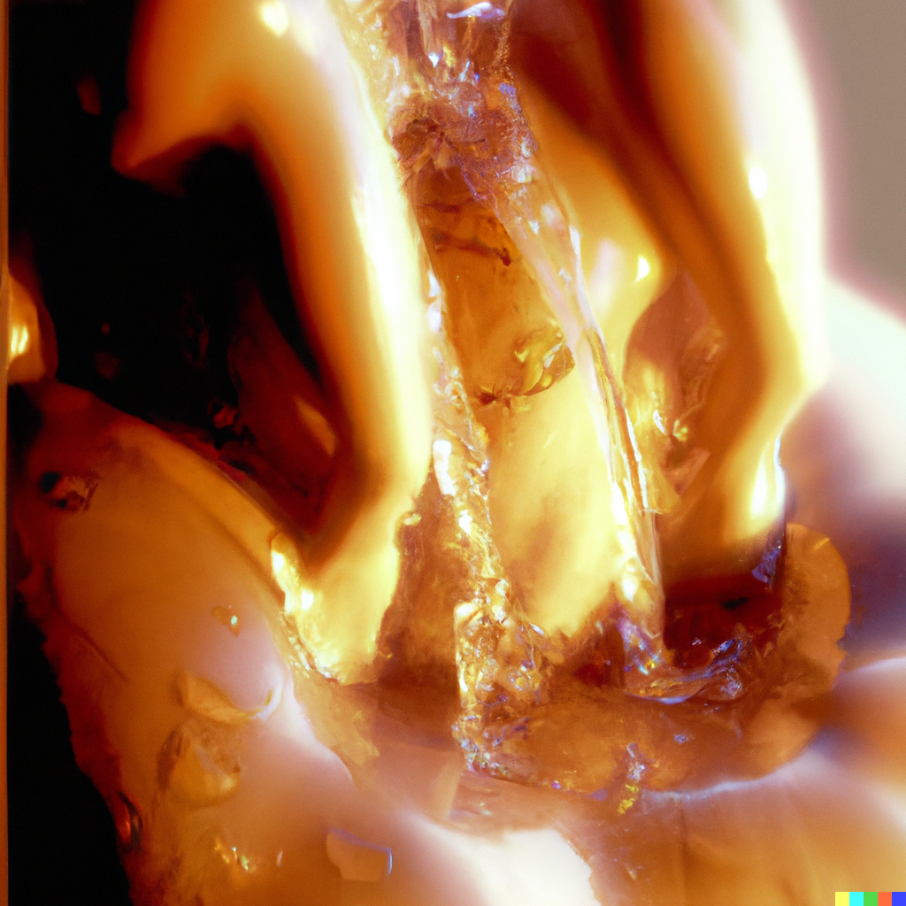
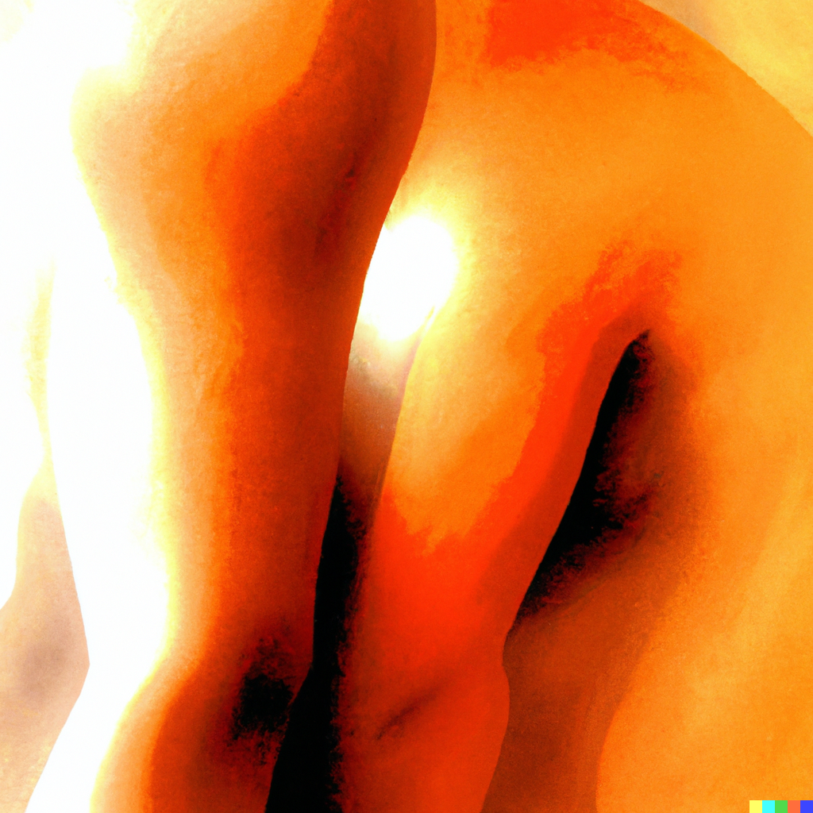
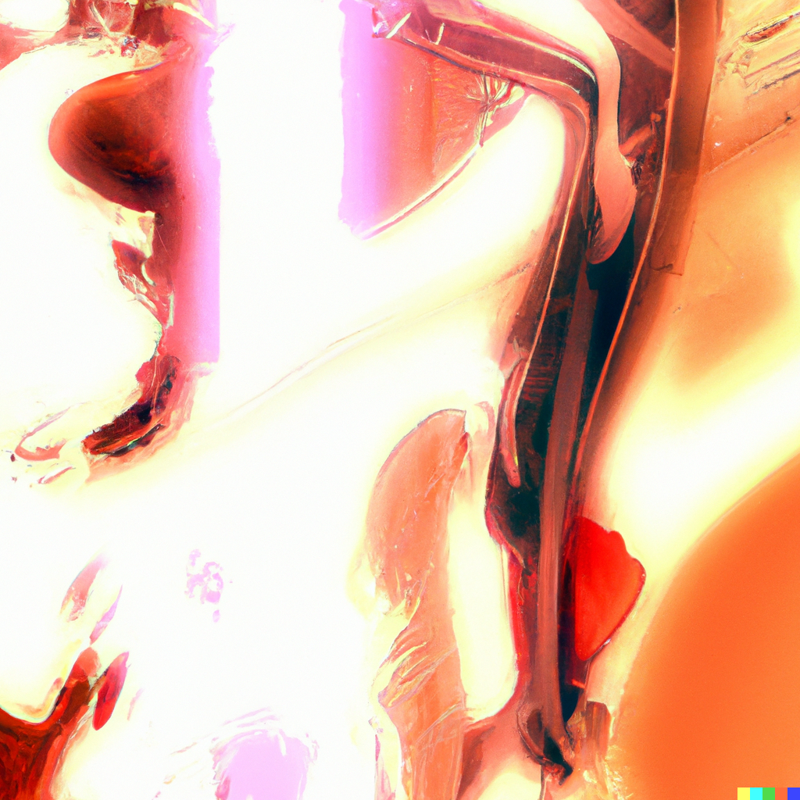
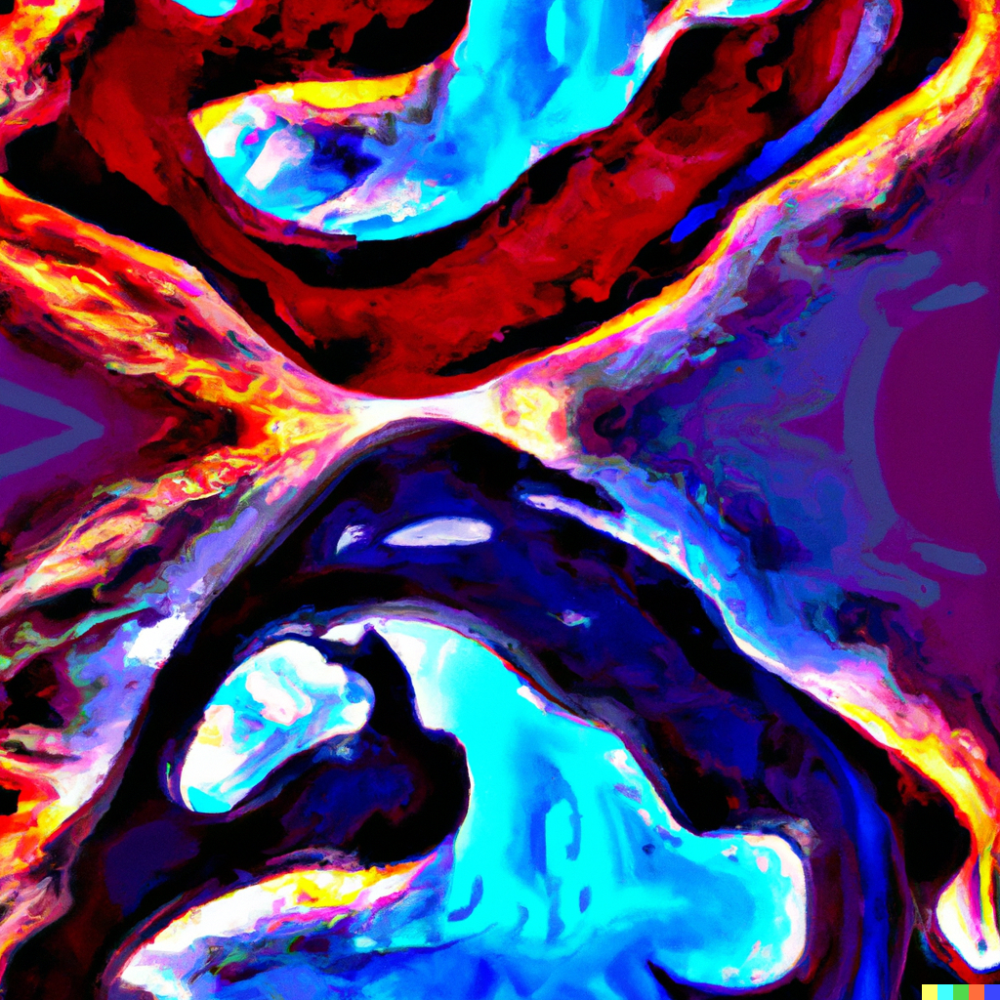
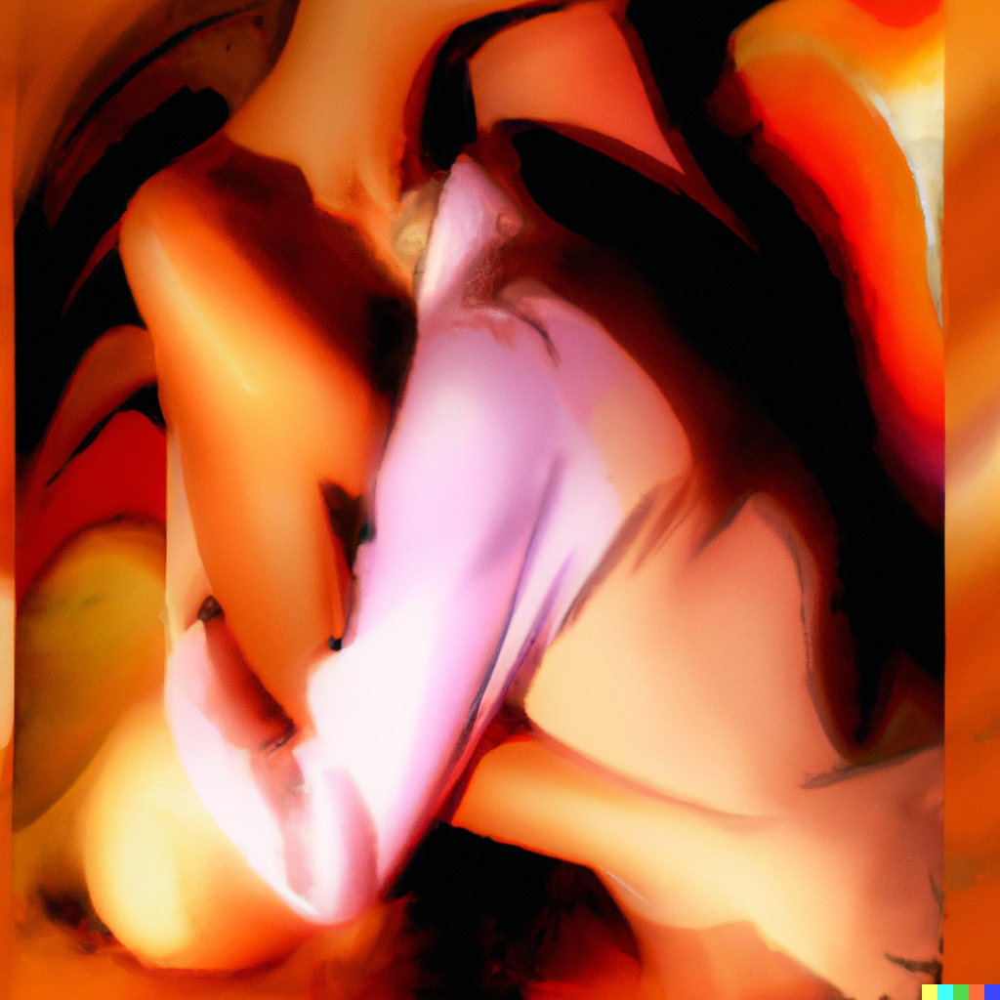
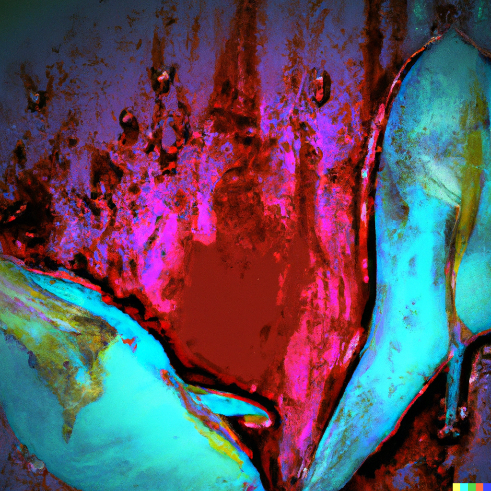
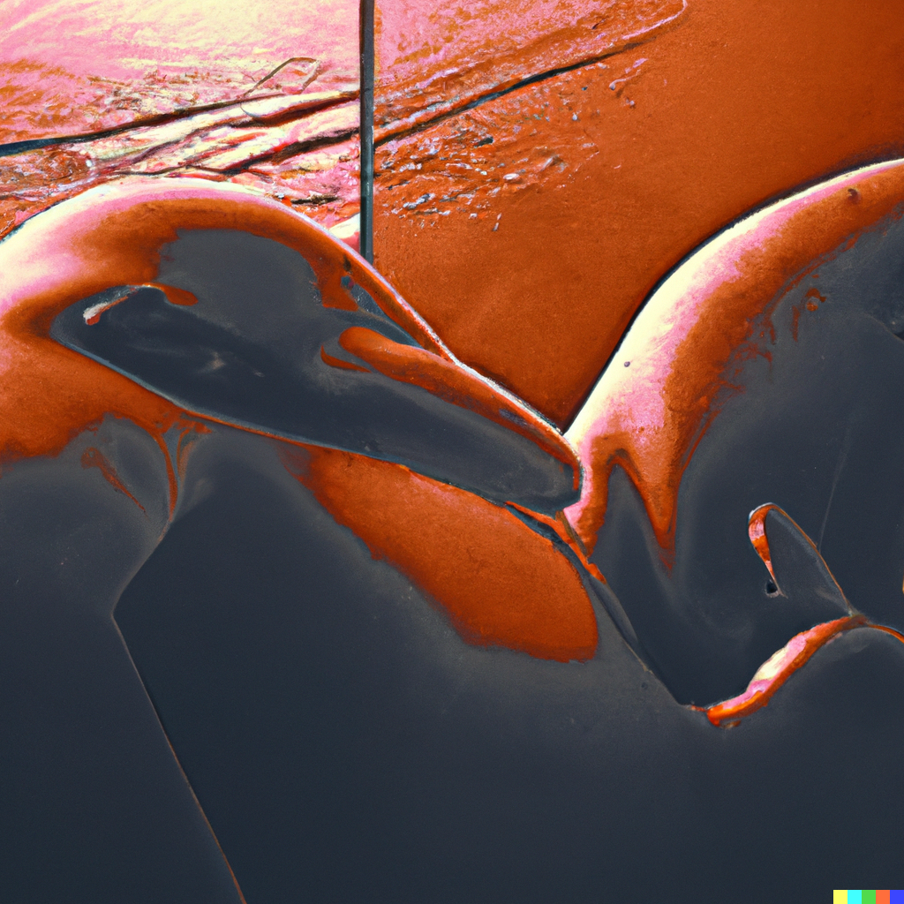

# Step 2

Note: re
Chakra: Womb (https://www.notion.so/Womb-a171d284715c4e4c86ec8857cbad332b?pvs=21)
Mantra: VAM
Aura: orange
Element: Water (https://www.notion.so/Water-a3bff97b68b94c88a71fa84538de1a64?pvs=21)
Bagua: K'an ☵ Water (https://www.notion.so/K-an-Water-ac51801bb8f741b0939c1aec517ffed7?pvs=21)
Sense: https://www.notion.so/29bdfe1243fd4060b003771c3183fd08, https://www.notion.so/3db15aeca25f43d98d623a432b59424e
Hermetic Principle: Causality (https://www.notion.so/Causality-b0d3023c4c0a4a1e81c4eafada338bb9?pvs=21)
Loveforms: Éros (https://www.notion.so/ros-a5939fa0237c494697e36b910703a218?pvs=21)
Loveform (Greek): ἔρως
Intent: have
Numerology: pair
Theme: affinity
Quality: affinity
Aspect: length
Act: feel
Modes of Persuasion: ethos, pathos
Money stage: https://www.notion.so/6cd82ab709fb43b6ae083c389e3de72b
Order: 2
Changes Above: https://www.notion.so/04d5bc68af9e44a183db6c8a833591fa, https://www.notion.so/0b57bb3d9ac34819b5fb34dac9059191, https://www.notion.so/12e3d4708198444681fe234e979a6d4a, https://www.notion.so/6a51f38c48954d0183f8a363a5537a0c, https://www.notion.so/8c31e50dface4134bdcd0bd8c07b2143, https://www.notion.so/a76f63735d81407190ab2b298f2f5c81, https://www.notion.so/b49fa441f88a4479984014f9b14d589a, https://www.notion.so/b778b8de85b443d2a83bafccbccec9ac
Changes Below: https://www.notion.so/796bf872f19848da9dc785258f91d818, https://www.notion.so/7b3290a2d15747eb92182e591f42ec06, https://www.notion.so/8094e6fc49f2451881158b5e619481c6, https://www.notion.so/b778b8de85b443d2a83bafccbccec9ac, https://www.notion.so/bb7c9ef44db744d0b1a7642e41fe098a, https://www.notion.so/e816f91c79924bd7a530bd369b826eaf, https://www.notion.so/e9ab5cee4c244720bf419a60eb8ff0b9, https://www.notion.so/f0870cd9172444c2a8bb7efe4fd7cd27
Major Arcana: The High Priestess (https://www.notion.so/The-High-Priestess-97e63428330540ed80c3c1eff7dd54d1?pvs=21), The Hanged Human (https://www.notion.so/The-Hanged-Human-cff6659bf9a04096a22d7e1588ee337c?pvs=21), The Empress (https://www.notion.so/The-Empress-d2de6c2410fc40a8866eaef902c9afe3?pvs=21)
Tarot Astrological Entities: https://www.notion.so/c6d7938769464d8db582d83470ff01db,https://www.notion.so/2b71725f599a4600b16f3a6e163c69f4,https://www.notion.so/18f2d35b8aee49dda692cb681354f933
Tarot Elements: Water,Water,Earth
Tarot Themes: intuition, subconscious, dreams,patience, mindfulness, sacrifice,self-care, fertility, sensuality, motherhood
Dimension: 1-D (https://www.notion.so/1-D-ea4ef5edc02b41b5b396131a1a3b428e?pvs=21)
Diment: line
Realm: ray
Early Season: Autumn
Early Direction: West
Later Season: Winter
Late Direction: North
Stories of Deep Well: Herd My Feelings (https://www.notion.so/Herd-My-Feelings-2dcad9d389144e159226f8b43dc8bcd7?pvs=21), Oli finds a friend (https://www.notion.so/Oli-finds-a-friend-983772450e6448deaf9159af4806630a?pvs=21), Every Sun is Someone’s (https://www.notion.so/Every-Sun-is-Someone-s-d5e65632ecc042f59c6f324f536b7789?pvs=21)
Previous step: Step 1 (Step%201%20ed190360d0084dcd8f333198a198c41d.md)
Next step: Step 3 (Step%203%20d5f972db63aa465d99844dbe04bfc2a8.md)
Dimensional Trinities: Shape (https://www.notion.so/Shape-1a52ddb8813980ac8020c38afbd14f74?pvs=21)
Rollup: https://www.notion.so/a171d284715c4e4c86ec8857cbad332b
Sacred Bodies: Astral body (https://www.notion.so/Astral-body-1a52ddb881398090afe7dbb867bc5ec2?pvs=21)
Timespace: Beta β time (https://www.notion.so/Beta-time-7163b92240c54a4aa46ce87d6330e819?pvs=21)
Vedic direction: West
Vedic pantheon: Varuna (https://www.notion.so/Varuna-a269a49b3d6542fcbc78ec6772bd25c3?pvs=21)

- Contents
    
    

> 🌰 **In a nutshell**
> 

## Poetics

A pair of high priestesses
wet like winter dolphins
twirling a double helix in the waves
erotic affinity their invisible bond
drawing ever nearer until touch
is not enough; they absorb into one.
Can the Papesse love a hanged man?
Does a camel have two humps?

## Aesthetics

sultry, sweaty, slippery, shiny, leather and skin, sunset, peach fuzz, dusky colors, fruit stained lips

## Theatrics

- Tiny oddity in a first encounter hints at a lifelong love affair
- Telepathic connections that don’t surprise anyone

> **🦆 Qualities**
> 

## Narrator

Cupid, or Dionysius. Gives an emotionally charged account of the goings-on within and between characters. Notices the innner monologues at play. Highlights how people first met as prophetic. An astrologist, perhaps.

## Tone

Psychic, confident, sultry, smoky. Sensual descriptions, erotic euphemism, flirty intrigue

## Themes

- Keeping each other warm
- Filling in the blanks
- Duos that just fit
- [The Gift of the Magi](https://www.wikiwand.com/en/The_Gift_of_the_Magi)
- [Love Moves](https://www.notion.so/Love-Moves-2d17c15484a74196890c6d9e40e3b034?pvs=21)
- 
- [Love Or Fear](https://www.notion.so/Love-Or-Fear-46698768e4b9454e9d098ff10136d520?pvs=21) + [Fear Or Joy](https://www.notion.so/Fear-Or-Joy-4d906ad67eed4f638a2da7b9c04eca01?pvs=21)
- [Love Over Fear](https://www.notion.so/Love-Over-Fear-2d7fe89d4b114ee3839bc5ee06081350?pvs=21)

## Symbols

- Peering into her crystal ball
- Insects mating frenetically
- Sexy fruit
- A dog that rides horses

