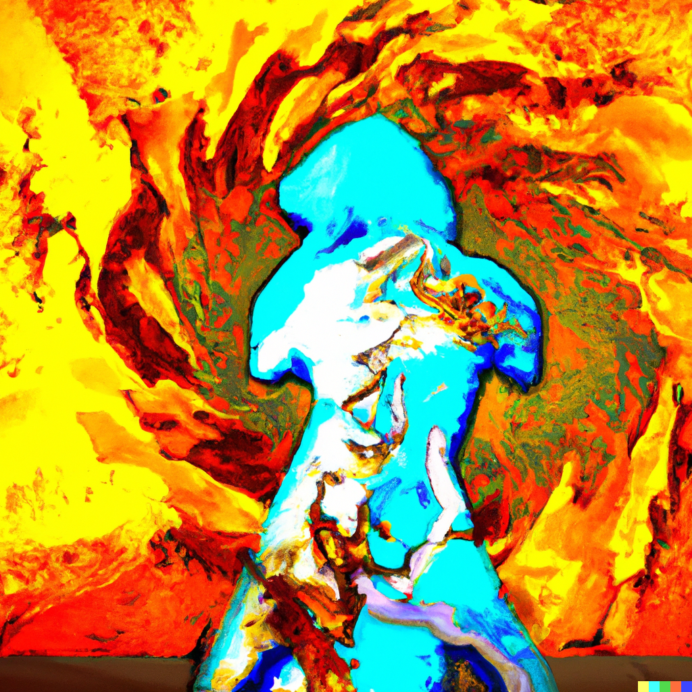
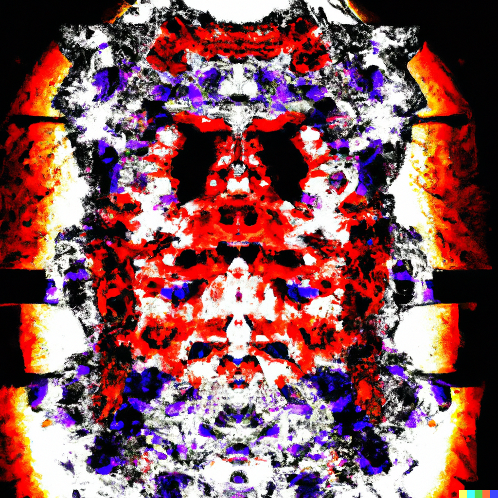
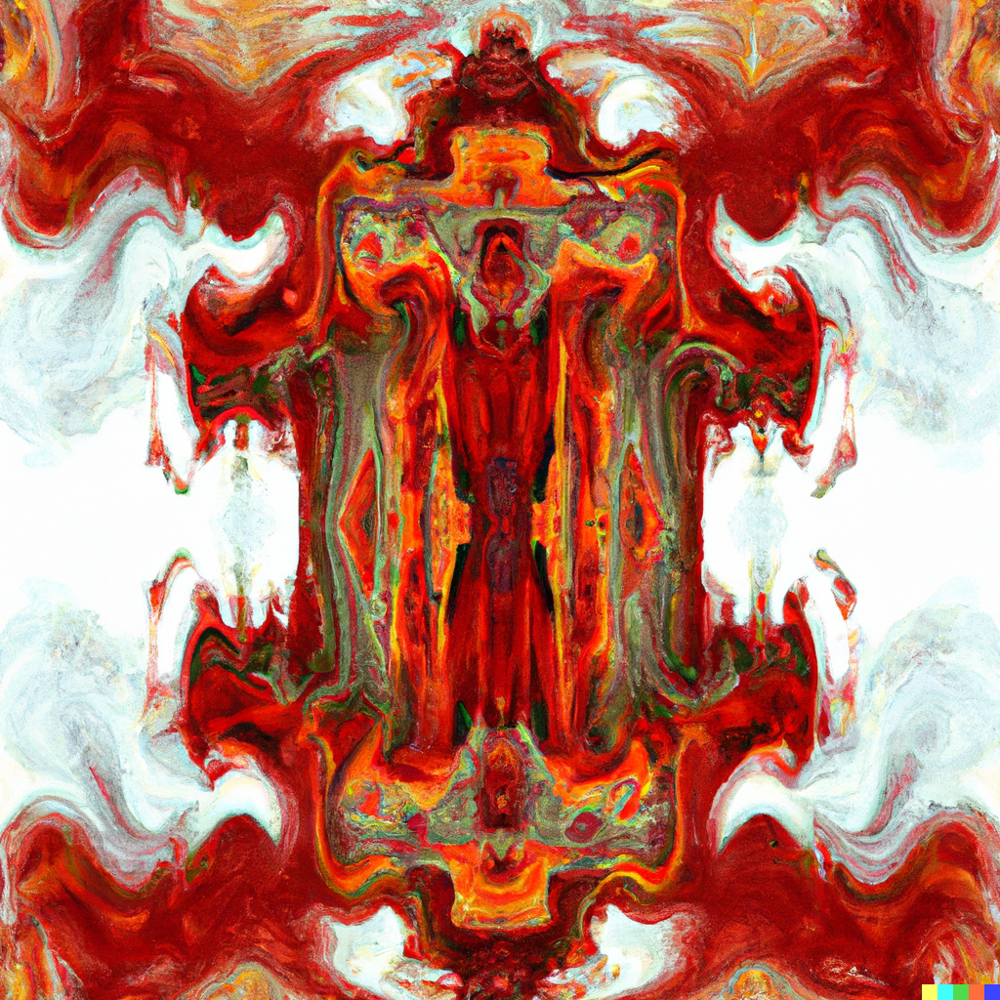
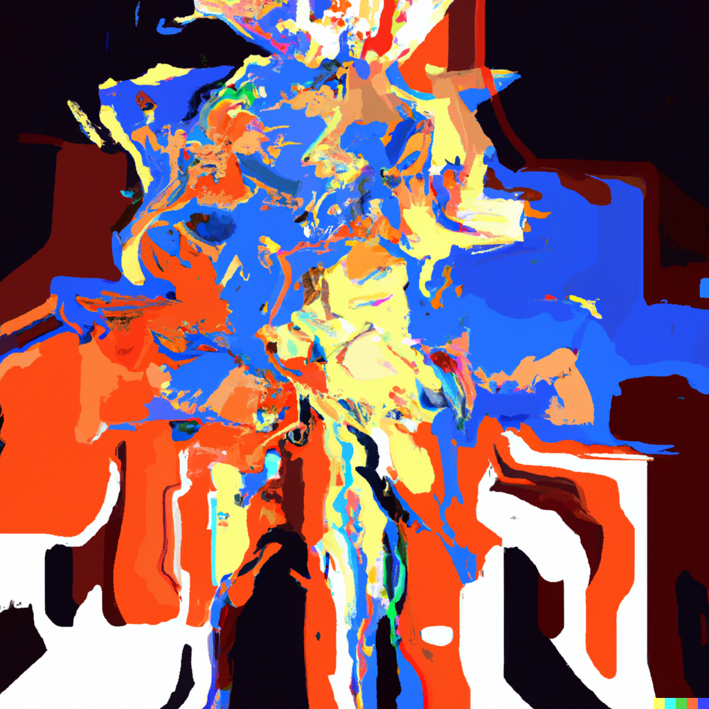
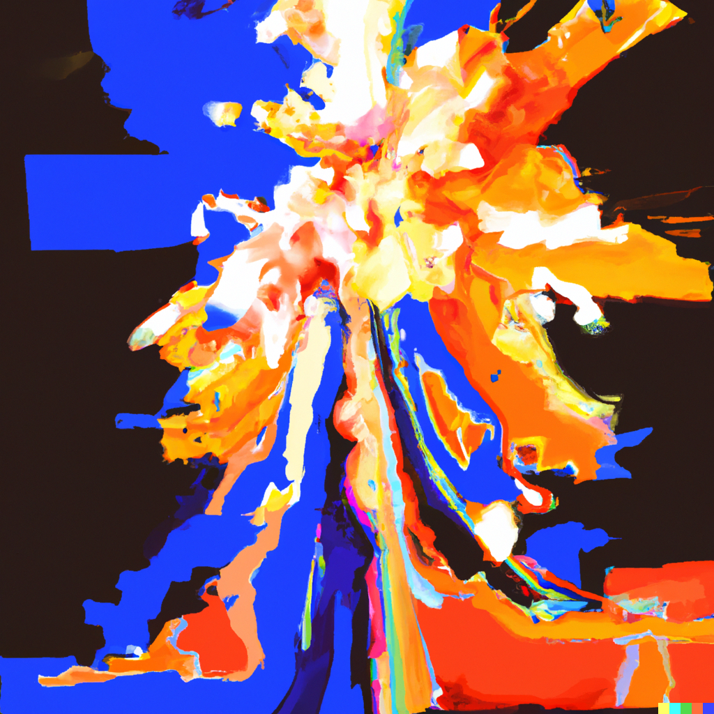
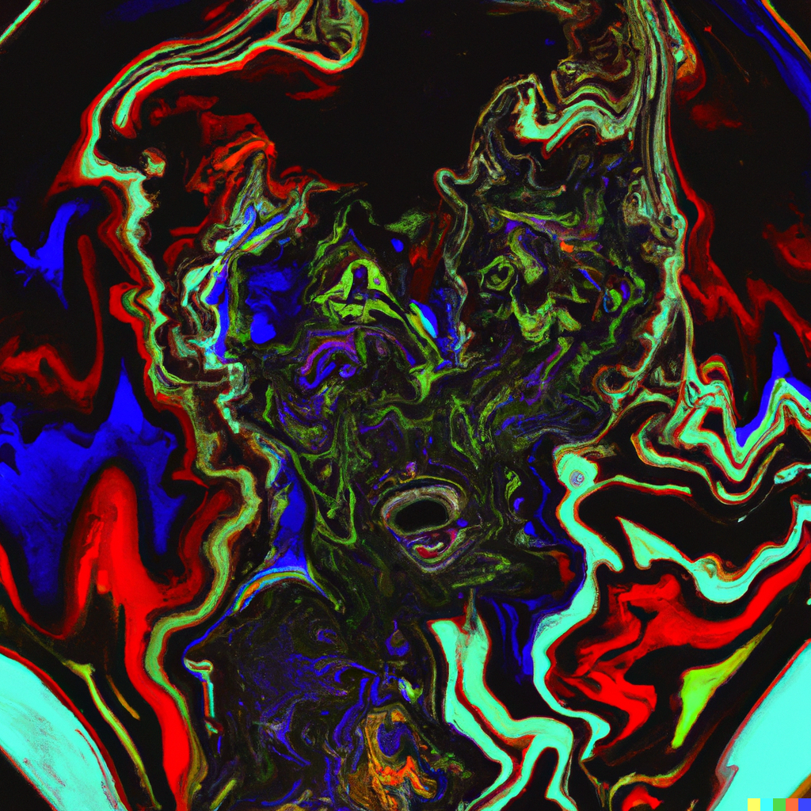

# Step 3

Note: mi
Chakra: Navel (https://www.notion.so/Navel-5ec2a1dac9f142469dfcfb6ddc4e309b?pvs=21)
Mantra: RAM
Aura: yellow
Element: Fire (https://www.notion.so/Fire-8c5bf8abe936487d8d1f5692feb5c500?pvs=21)
Bagua: Li ☲ Fire (https://www.notion.so/Li-Fire-2872efe3426a4f6b8800c667f58f0e55?pvs=21)
Sense: https://www.notion.so/32c78e65c73b42fdb4c37ed30058d303, https://www.notion.so/91a2fad36e734b7a9e13833497f4f2c9
Hermetic Principle: Polarity (https://www.notion.so/Polarity-b4b62effd7434f2eaef403fd1f7f34da?pvs=21)
Loveforms: Mania (https://www.notion.so/Mania-c309eb73846f427eaf7bcd508980b2c3?pvs=21)
Loveform (Greek): μανία
Intent: make
Numerology: ideal
Theme: willpower
Quality: activity
Aspect: width
Act: dance
Modes of Persuasion: ethos, logos
Money stage: https://www.notion.so/8488c301835645adb25716963fdbb1de
Order: 3
Changes Above: https://www.notion.so/2b7227711a8e481680c136ea4f3614da, https://www.notion.so/45c33ebf6a784447b5a8beacaaf4651f, https://www.notion.so/4d511ca8d6694f3c8734384474306205, https://www.notion.so/67dadfc192e741c6a3b3ff61ea0cc8eb, https://www.notion.so/8d1ef033320646c4978f55d1bbb7ef65, https://www.notion.so/aa274c1dea6d41a683440309ebb0a2c2, https://www.notion.so/b82d1a14ecc648508c5bd6b58a1897ef, https://www.notion.so/e9ab5cee4c244720bf419a60eb8ff0b9
Changes Below: https://www.notion.so/25630dd5688f4300b3589de3e1f6fb7a, https://www.notion.so/3097e1d4a5b04a44a62dd34ef84cb1c0, https://www.notion.so/4924b80c7657485ba01f8e35110c70c7, https://www.notion.so/8c31e50dface4134bdcd0bd8c07b2143, https://www.notion.so/a2006516c8e345f79d90efe8c96a7571, https://www.notion.so/aa274c1dea6d41a683440309ebb0a2c2, https://www.notion.so/b39d16cabc004081aaeb330d636e7ee8, https://www.notion.so/fe50edfbceb54629b8dac419a95ddd81
Major Arcana: Death (https://www.notion.so/Death-747a50d45881497884ff03c900d4fe5b?pvs=21), The Emperor (https://www.notion.so/The-Emperor-f4bd466b1a234384a1f893045567cedd?pvs=21)
Tarot Astrological Entities: https://www.notion.so/d15909a7796a4ad7b7e0c90967af5879,https://www.notion.so/80fc83a5c1b4441688b9cc458ebc4c84
Tarot Elements: Water,Fire
Tarot Themes: inevitability, transition, metamorphosis,authority, structure, rules
Dimension: 2-D (https://www.notion.so/2-D-b3dc708b435f4a0484c860a2f6d4125c?pvs=21)
Diment: plane
Realm: shape
Early Season: Spring
Early Direction: East
Later Season: Summer
Late Direction: South
Stories of Deep Well: Omo Ablaze (https://www.notion.so/Omo-Ablaze-dfc1da448cdf4315ad9cbbd88c7fa4dc?pvs=21), Oli, Chapter 3 (https://www.notion.so/Oli-Chapter-3-8d3f201bbab64ac69edc54485fd93943?pvs=21), Sol, Chapter 3 (https://www.notion.so/Sol-Chapter-3-c9d2b260a7544a8eb5d4cc903d85bf82?pvs=21)
Previous step: Step 2 (Step%202%2041950383183249debe77926aa251200e.md)
Next step: Step 4 (Step%204%2091828741a5bd427abd83dd79ab59de30.md)
Dimensional Trinities: Space (https://www.notion.so/Space-1a52ddb881398084be48d021f011cd62?pvs=21)
Rollup: https://www.notion.so/5ec2a1dac9f142469dfcfb6ddc4e309b
Sacred Bodies: Mental body (https://www.notion.so/Mental-body-1a52ddb8813980cbaabdfb155fdb62de?pvs=21)
Timespace: Gamma γ time (https://www.notion.so/Gamma-time-a1d70fca1e0e4162846fc65a956c9139?pvs=21)
Vedic direction: Southeast
Vedic pantheon: Agni (https://www.notion.so/Agni-ad0bb5ca5d8c450788dd501048c56ed2?pvs=21)

- Contents
    
    

> 🌰 **In a nutshell**
> 

## Poetics

The mania of obsession stokes the wildfire of discovery, 
cleaving a narrow path wider,
clearing the dancefloor 
for something ideal to take shape.

I feel the heat building
as the agni spools up,
this changeable, formless battery
for the cleansing fire of activity
meanwhile I do anything, dance askance, 
I make whatever anywhere I can, ground, floor, sky
driven to mania, that possessive love of life
my solar plexus beams through me
a column of light growing wider
well defining my ability to shape
until I can step into the empress,
or spook the mortals back to meaning.

## Aesthetics

singed, sinewy, grimy, color burn, comic book, bold and saturated

## Theatrics

- setting your hair on fire
- getting heat stroke in your wedding dress
- burning through your savings

> **🦆 Qualities**
> 

## Narrator

a director, or commander, someone in charge, pulling the strings

## Tone

imperative, active voice, action verbs, action packed, terse, direct speech

## Themes

- Gut [Intuition](https://www.notion.so/Intuition-733b265e4d254da18895453c6135e216?pvs=21)

[free will](https://www.notion.so/free-will-293163c01ad844729e427f5373762b10?pvs=21) 

[Free Wont](https://www.notion.so/Free-Wont-f520fb1d581246728f67b608f252b53c?pvs=21) 

[Free Bird](https://www.notion.so/Free-Bird-4e16066f03924142aba573d7d7f4085b?pvs=21) 

[‣  vs. [free will](https://www.notion.so/free-will-293163c01ad844729e427f5373762b10?pvs=21) ](https://www.notion.so/vs-1c58587c35104cd6b53e897a4d670926?pvs=21) 

[Determinism Vs Teleonomy](https://www.notion.so/Determinism-Vs-Teleonomy-b8065998eb6345da9987047d69278fd9?pvs=21) 

[Quantum Reality And The Illusion Of Material Determinism](https://www.notion.so/Quantum-Reality-And-The-Illusion-Of-Material-Determinism-059a452ae2f74e09a06bd096f102dc7d?pvs=21) 

[Sovereignty](https://www.notion.so/Sovereignty-9c56da6b15bd4c998dfe7ae34c55c42e?pvs=21) 

[Sovereign](https://www.notion.so/Sovereign-1ee2bda08bf343a6803650e6f05c1656?pvs=21) 

[How To Be Sovereign](https://www.notion.so/How-To-Be-Sovereign-1a2ba2615c344b73b5a4b82c0a41b453?pvs=21) 

[Self Sovereign Manifesto](https://www.notion.so/Self-Sovereign-Manifesto-9f0c6fe5546e4740aed2cf194130116d?pvs=21) 

[Identity Or Sovereignty](https://www.notion.so/Identity-Or-Sovereignty-79f2c86c5ed0466bb64058f15e8ffd2d?pvs=21) 

[Existing As Sovereign](https://www.notion.so/Existing-As-Sovereign-fceea7426996402c96447ace93253150?pvs=21) 

## Symbols

- burning (desire)
- smoldering (glances)
- go with your gut
- gut feelings

