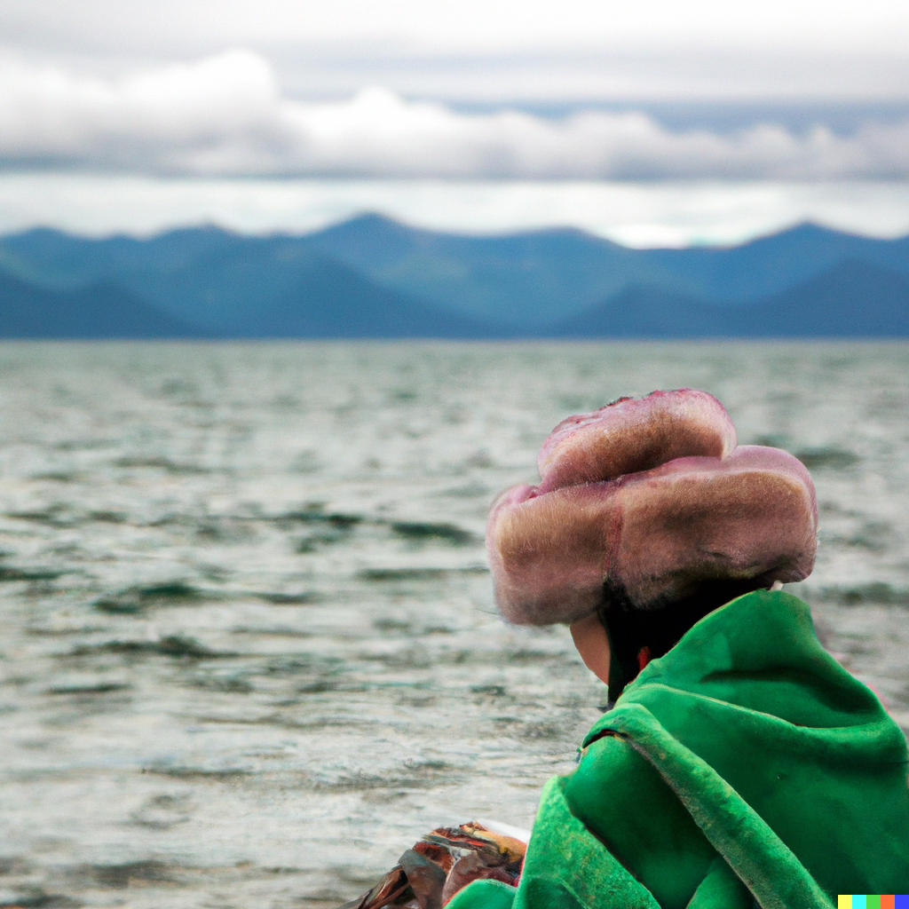
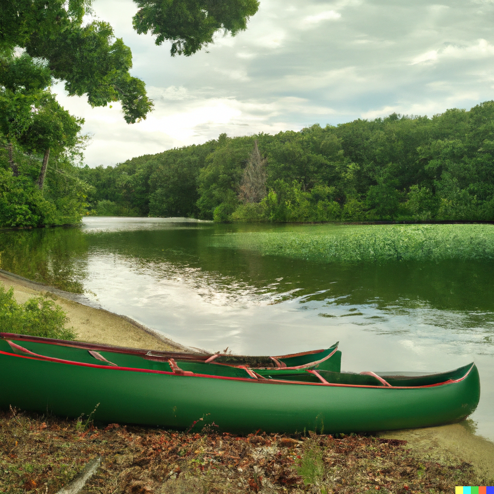
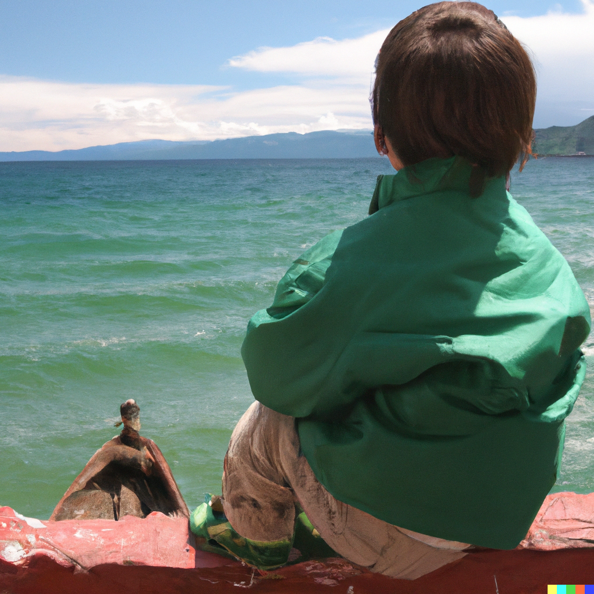

# Step 4

Note: fa
Chakra: Heart (https://www.notion.so/Heart-3d7649af72244607a719f7d5c3691b61?pvs=21)
Mantra: YAM
Aura: green
Element: Life (https://www.notion.so/Life-dccccd73d4b24fb08bcdeeacc2d0954a?pvs=21)
Bagua: Dui ☱ Lake (https://www.notion.so/Dui-Lake-72ad4fa63e5945239623987ea80d848b?pvs=21)
Sense: https://www.notion.so/5d44f1606d5c4d64854c58583c4f0b6c, https://www.notion.so/9d80586c65a1496297dbbd4dcf3fe101, https://www.notion.so/ef24d01e926a478fb8cea6780df17a22
Hermetic Principle: Rhythm (https://www.notion.so/Rhythm-1d762186b8584e208a5647e0c00b4cba?pvs=21)
Loveforms: Storge (https://www.notion.so/Storge-1d35e77bb0c44687a5d24366df2fe49d?pvs=21)
Loveform (Greek): στοργή
Intent: live
Numerology: balance
Theme: love
Quality: capacity
Aspect: depth
Act: listen
Modes of Persuasion: kairos, pathos
Money stage: https://www.notion.so/f78f552d6cc44ae5aec6c20bcd17eaae
Order: 4
Changes Above: https://www.notion.so/09ce559c44b44883bc1f63e82f962a5e, https://www.notion.so/13c87ffb38154b46a39743e16643623f, https://www.notion.so/226c0734d1274fd78ae8b26770bf6e78, https://www.notion.so/43e2442138f947408f361bf3b0b24bec, https://www.notion.so/796bf872f19848da9dc785258f91d818, https://www.notion.so/8a08ba6b29b348a29cdcb850816ffe1e, https://www.notion.so/a2006516c8e345f79d90efe8c96a7571, https://www.notion.so/c1bd10bad5a449819476cb65cdc371e8
Changes Below: https://www.notion.so/04d5bc68af9e44a183db6c8a833591fa, https://www.notion.so/087c0dd5238c43d9a00f5f2dd85add29, https://www.notion.so/1012b2d8693e4b91845831cdd122b517, https://www.notion.so/403da1ddb2c64db295b83950b4ed154e, https://www.notion.so/457e41f1cdd84c17bd57f87027dc5c64, https://www.notion.so/4d511ca8d6694f3c8734384474306205, https://www.notion.so/620b40be921b46228767ae7fc9fe86fa, https://www.notion.so/8a08ba6b29b348a29cdcb850816ffe1e
Major Arcana: Temperance (https://www.notion.so/Temperance-76a453e05bd64413baba7d20c2eeb6b0?pvs=21), The Hierophant (https://www.notion.so/The-Hierophant-ee57da8ed8a240118902c4a2e0f20d40?pvs=21)
Tarot Astrological Entities: https://www.notion.so/651e10926a524997a5c5412e74334841,https://www.notion.so/8ccc84ff834441ec8ec6950bfbc87bcb
Tarot Elements: Fire,Earth
Tarot Themes: blending, harmony, moderation,tradition, wisdom, ethics, morality
Dimension: 3-D (https://www.notion.so/3-D-cf0e7920611842f2b623c2955f078ac9?pvs=21)
Diment: sphere
Realm: form
Early Season: Spring,Summer
Early Direction: Southeast
Later Season: Autumn
Late Direction: West
Stories of Deep Well: Anu, Chapter 4 (https://www.notion.so/Anu-Chapter-4-2e273def7cce495793dd531f0cf4b6e4?pvs=21), Oli, Chapter 4 (https://www.notion.so/Oli-Chapter-4-2bba5ca4ef51418c8449e847cbe41654?pvs=21), Sol, Chapter 4 (https://www.notion.so/Sol-Chapter-4-3c51f96584c946b7a7d7290e277bebc9?pvs=21)
Previous step: Step 3 (Step%203%20d5f972db63aa465d99844dbe04bfc2a8.md)
Next step: Break 4/5 (Break%204%205%20241d833af1e24ad6bf88565ff731c374.md)
Dimensional Trinities: Time (https://www.notion.so/Time-1a52ddb8813980eb8c99ed4c27722c2c?pvs=21)
Rollup: https://www.notion.so/3d7649af72244607a719f7d5c3691b61
Sacred Bodies: Causal body (https://www.notion.so/Causal-body-1a52ddb8813980b1adcaf96818331769?pvs=21)
Timespace: Delta δ time (https://www.notion.so/Delta-time-38acb6bab71d46ec9e5bae835ca432fb?pvs=21)
Vedic direction: Northeast
Vedic pantheon: Ishana (https://www.notion.so/Ishana-194450551586412fb5956531f95a6ca9?pvs=21)

- Contents
    
    

> 🌰 **In a nutshell**
> 

## Poetics

The future Emperor sits upon the green lake, wondering its depth. Bracing his sealskin boot against the far inner wall of the canoe as he leans, he and the canoe find a slow equilibrium as his ear nears the taut surface. This time on Lake Baikal creates depth as well within, expands capacity for the sort of love that binds a family together: *storge*. From the silty bottom he can sense a subtle mucky throb, a one-note lovesong forevermore.

But tarry not in solace. A squall churns just below the horizon. The lake quivers with unseen tension. A break approaches.

## Aesthetics

Verdant and mossy, downy carpeted sealskin and dense oiled teak wood finely sanded, gently rounded

## Theatrics

- pouring your heart out into a container or vessel
- hooking your heartbeat up to an amplified soundsystem
- wearing sleeves that represent precisely how you feel

> **🦆 Qualities**
> 

## Narrator

An aging journeyhuman by the wayside of a path once well-trod

## Tone

Simple, irreverent, kind, wise, sharp

## Themes

- Family matters
- Capacity a la [Orland Bishop](https://www.notion.so/Orland-Bishop-4664b209a5ce4dce82296a76936b0db8?pvs=21)
- Parenting our friends
- Toward deeper water
- Carving out space within
- Finding zen anywhere
- Deepening our bonds
- [Shibumi - Zen Design](https://www.notion.so/Shibumi-Zen-Design-4ef37eb58e6d43eea2880c3dec0d6561?pvs=21)
- [6-Point Meditation Prep](https://www.notion.so/6-Point-Meditation-Prep-2630b7f1f5ae41c1b6b4cd0ee299a5ac?pvs=21)
- [The Way Of Zen](https://www.notion.so/The-Way-Of-Zen-b8e1d1890a0e4960a70aac8bbb62b493?pvs=21)
- [Snuck into the World Peace Summit](https://www.notion.so/Snuck-into-the-World-Peace-Summit-acb8c86c9502428a93e1be58c26b6cb3?pvs=21)
- [Following the Chartreuse Pulsing Pendants](https://www.notion.so/Following-the-Chartreuse-Pulsing-Pendants-d99dc954ab3047f9b4566c5ee210f046?pvs=21)

## Symbols

- A table left set
- A frozen heart thawed with one last beat
- A voice from the deep bubbling up
- A glow from the chest

## Imagery

