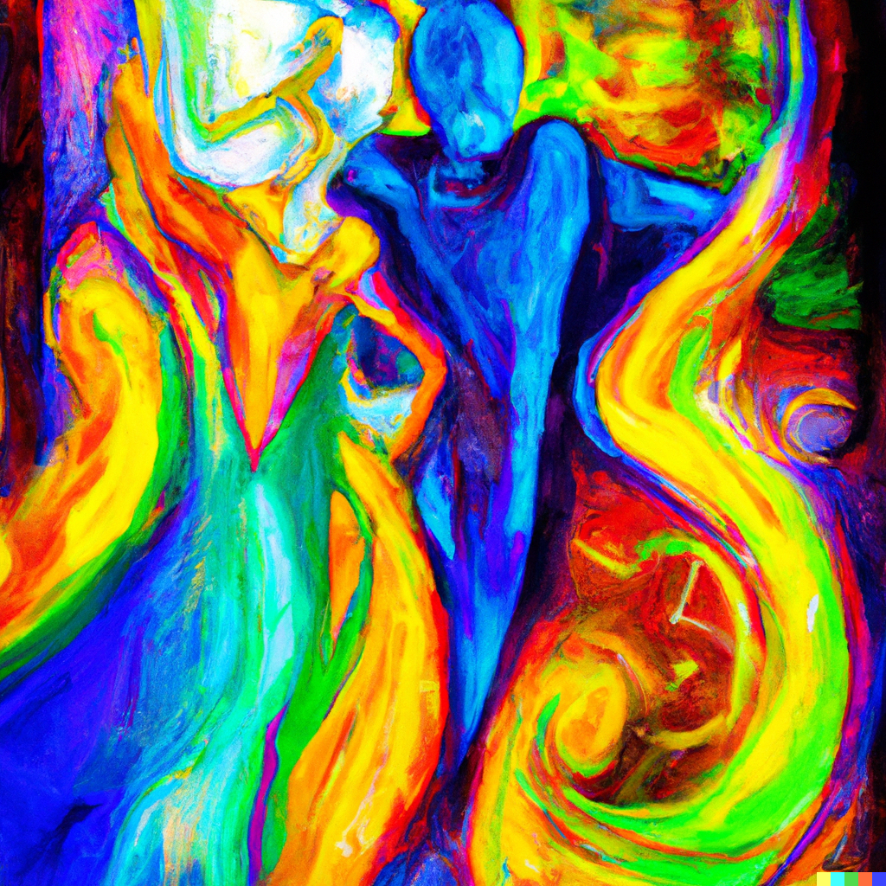
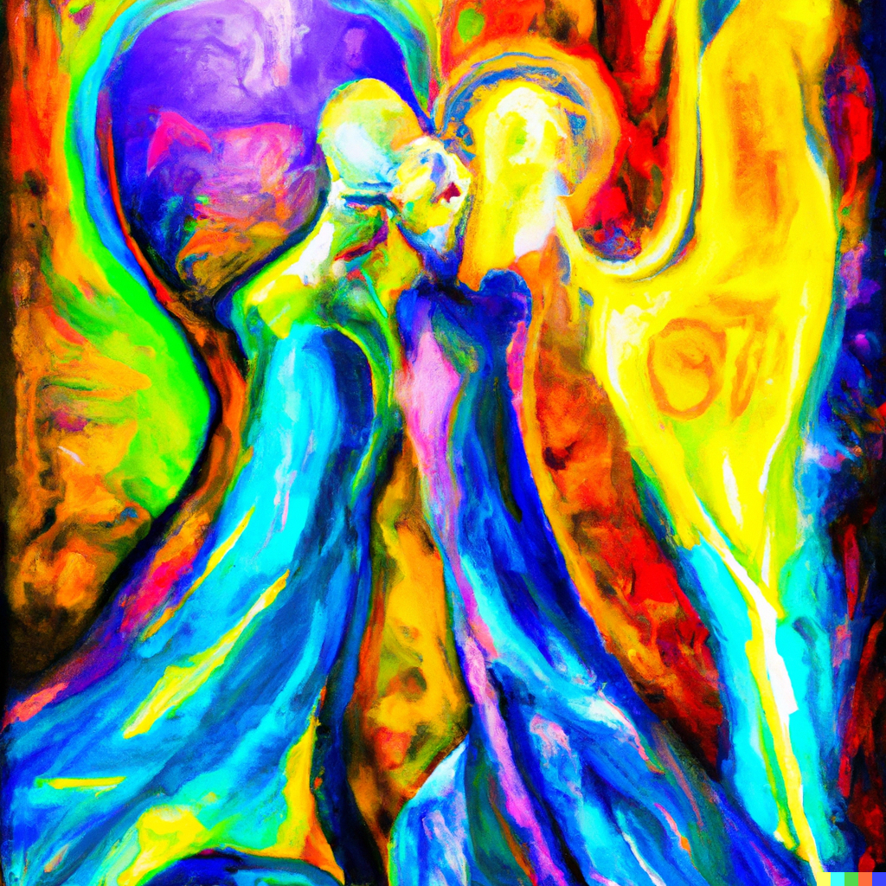
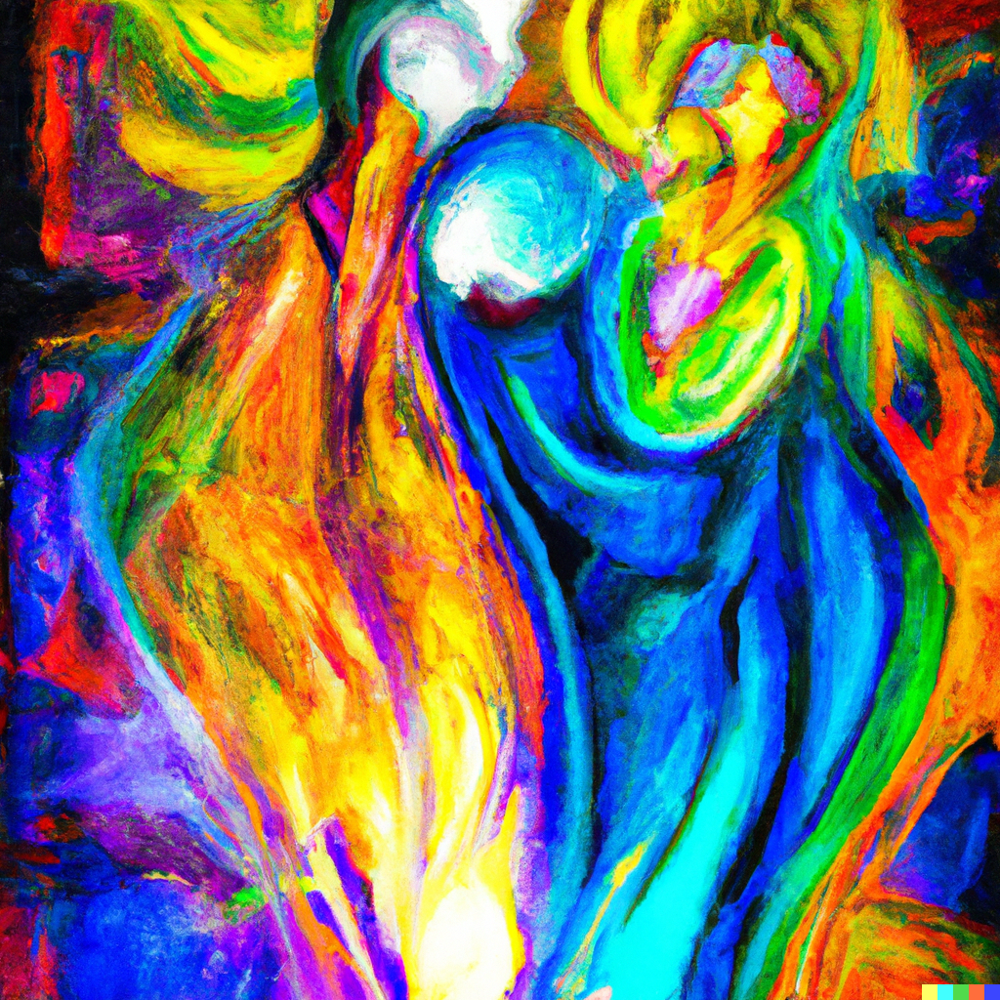
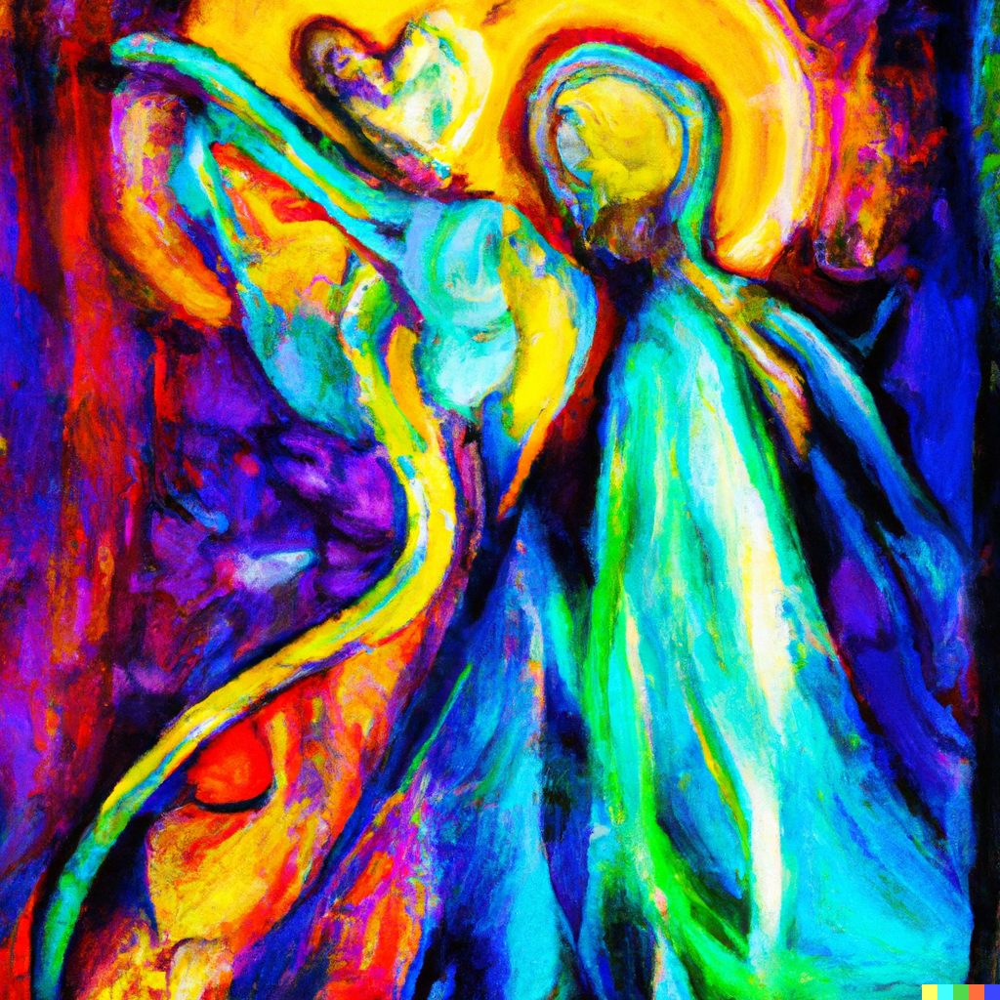

# Step 5

Note: so
Chakra: Voice (https://www.notion.so/Voice-c49bd1b37ee44fabb92ab669de6b043c?pvs=21)
Mantra: HAM
Aura: blue
Element: Air (https://www.notion.so/Air-4774d1f3fabc490b83c9640fbf6fdbe2?pvs=21)
Bagua: Xun ☴ Wind (https://www.notion.so/Xun-Wind-c5e6494660694a54a2b3a103fe68b7ed?pvs=21)
Sense: https://www.notion.so/6a3b1c8c88554d02b40bfc62aa21a5c7, https://www.notion.so/914ee560ba6143e48696342ec9454a29
Hermetic Principle: Vibration (https://www.notion.so/Vibration-aef6d6621a1e4a7f9faf9028270aa68e?pvs=21)
Loveforms: Philia (https://www.notion.so/Philia-dae1b78266084674abf62ef880fb921e?pvs=21)
Loveform (Greek): φιλία
Intent: say
Numerology: beauty
Theme: song
Quality: causality
Aspect: duration
Act: sing
Modes of Persuasion: ethos, logos
Money stage: https://www.notion.so/6ff418e9be574b65b0dee56b3e6f4b95
Order: 6
Changes Above: https://www.notion.so/403da1ddb2c64db295b83950b4ed154e, https://www.notion.so/642209105e3148a09ab5fde6e9645607, https://www.notion.so/6ae787f5046a4fecac2a4f6742268e0f, https://www.notion.so/b2faad753fc1439eb3dbfa5462bc59cc, https://www.notion.so/b39d16cabc004081aaeb330d636e7ee8, https://www.notion.so/dba1bd75c2e54a99b68396c4ab6fda20, https://www.notion.so/df638efa907f4957ad38ec629412ed80, https://www.notion.so/e816f91c79924bd7a530bd369b826eaf
Changes Below: https://www.notion.so/10013f25202245f1b6f2fd1617f53286, https://www.notion.so/6ae787f5046a4fecac2a4f6742268e0f, https://www.notion.so/6f46561aaa5c4231a46688b898154c6f, https://www.notion.so/a5bda03d779940918c3ea409f8021203, https://www.notion.so/b49fa441f88a4479984014f9b14d589a, https://www.notion.so/b82d1a14ecc648508c5bd6b58a1897ef, https://www.notion.so/c1bd10bad5a449819476cb65cdc371e8, https://www.notion.so/df4d529bf03d4dcab1d605bced7b19d3
Major Arcana: The Lovers (https://www.notion.so/The-Lovers-07b31a3e42744c02b5367d3411594ed6?pvs=21), The Chariot (https://www.notion.so/The-Chariot-c12a8383bfda47bfb81a69b8d326e56d?pvs=21)
Tarot Astrological Entities: https://www.notion.so/c1421cf5b02a4ab38f0cbb588a272da8,https://www.notion.so/0ae17fec03f54a40b7289b1433026f96
Tarot Elements: Air,Water
Tarot Themes: relationships, harmony, compassion,focus, determination, drive
Dimension: 4-D (https://www.notion.so/4-D-86503caaafdd4605b102eaafad1aa237?pvs=21)
Diment: phase
Realm: mind
Early Season: Autumn,Summer
Early Direction: Southwest
Later Season: Spring,Summer
Late Direction: Southeast
Stories of Deep Well: Anu, Chapter 6 (https://www.notion.so/Anu-Chapter-6-190f0c2c5aa240f0806a640d9d398bf6?pvs=21), Oli, Chapter 6 (https://www.notion.so/Oli-Chapter-6-501f1c8fe86d422296ced49992b6338e?pvs=21), Sol, Chapter 6 (https://www.notion.so/Sol-Chapter-6-f9d4b5c194014023a92ea89656284f12?pvs=21)
Previous step: Break 4/5 (Break%204%205%20241d833af1e24ad6bf88565ff731c374.md)
Next step: Step 6 (Step%206%2075b794532f444365bc14e6e551a547ce.md)
Dimensional Trinities: Transcendence (https://www.notion.so/Transcendence-1a52ddb8813980eb96dbe4cc9e4f6a0e?pvs=21)
Rollup: https://www.notion.so/c49bd1b37ee44fabb92ab669de6b043c
Sacred Bodies: Buddha body (https://www.notion.so/Buddha-body-1a52ddb8813980e09070dc5b9679698a?pvs=21)
Timespace: Zeta ζ time (https://www.notion.so/Zeta-time-c459e5dcaac94c27be23d153c64a3d88?pvs=21)
Vedic direction: Northwest
Vedic pantheon: Vayu (https://www.notion.so/Vayu-a4d43ab81eea4f9584976b5058b3269a?pvs=21)

- Contents
    
    

> 🌰 **In a nutshell**
> 

## Poetics

Exhale for a spell;
watch your wants come to pass.
The shimmering wind carries the beauty within you into being, like taffy stretched from the bottom of your heart around the ears nearby.

Songs cause and cleave friendships. Harmony creates twins for the sounds around. Discord creates orphans.

As your voice rises from your heart, what you love grows to surround and support you. Should your voice fall from your head, what you fear shall cake the world.

## Aesthetics

- Flowing currents
- new weather patterns
- swirling leaves
- stirring cream into coffee
- talking over the din
- windswept plains
- tossled hair
- Sharp contrasts: dry and wet, dark and light, cold and hot, etc.

## Theatrics

- Fighting to be heard in a loud room that suddenly goes quiet and you’re screaming “I hate sex” -ctions of…
- Having your voice change suddenly, as in puberty, or techno-surgically

> **🦆 Qualities**
> 

## Narrator

Janus: ambiguous, ambivalent, wavering, bipolar, borderline. An unreliable but mellifluous narrator. Loves the sound of their own voice as much as we do. In bits poetic and winsome, Janus reminds us that pride cometh before the fall, by example.

## Tone

- Bombastic, boastful, extravagant.
- Like a speakeasy jazz solo over a heart-pounding trance anthem.
- A lover that seduces your parents on the day you were going to dump them.

## Themes

- The raw power of sound
- The pendulum swings
- Tonedeafness and gusto don’t mix
- Opposites repel until very close
- Like attracts like until very close
- Migratory patterns
- [Sam Keen's Tiny Voice](https://www.notion.so/Sam-Keen-s-Tiny-Voice-de72db8057db42bc9822ac2e53a7041d?pvs=21)
- [Wielding the power of prophetic speech](https://www.notion.so/Wielding-the-power-of-prophetic-speech-53224effdf0c43a69332c887a810f375?pvs=21)
- [Manifesto Drafts](https://www.notion.so/Manifesto-Drafts-645147337aea4fb0a2495d9aa8791125?pvs=21)
- [Get Real Manifesto](https://www.notion.so/Get-Real-Manifesto-c6ce9a8ab4e54c91bd2954f9bbc35621?pvs=21)
- [Self Sovereign Manifesto](https://www.notion.so/Self-Sovereign-Manifesto-9f0c6fe5546e4740aed2cf194130116d?pvs=21)
- [Life Is What You Manifest](https://www.notion.so/Life-Is-What-You-Manifest-4dbe898a92df4b68ae7244ffa69521ff?pvs=21)
- [Affinity](https://www.notion.so/Affinity-3b081df3b5af44f18a32c7961cfa16ea?pvs=21)
- [Affinity Elevator](https://www.notion.so/Affinity-Elevator-028e5f23ea6642599e717f6b906403be?pvs=21)

## Symbols

- a ringing coin mid-toss
- a bell unstruck (anahata)
- look what just blew in
- seeing one’s breath

