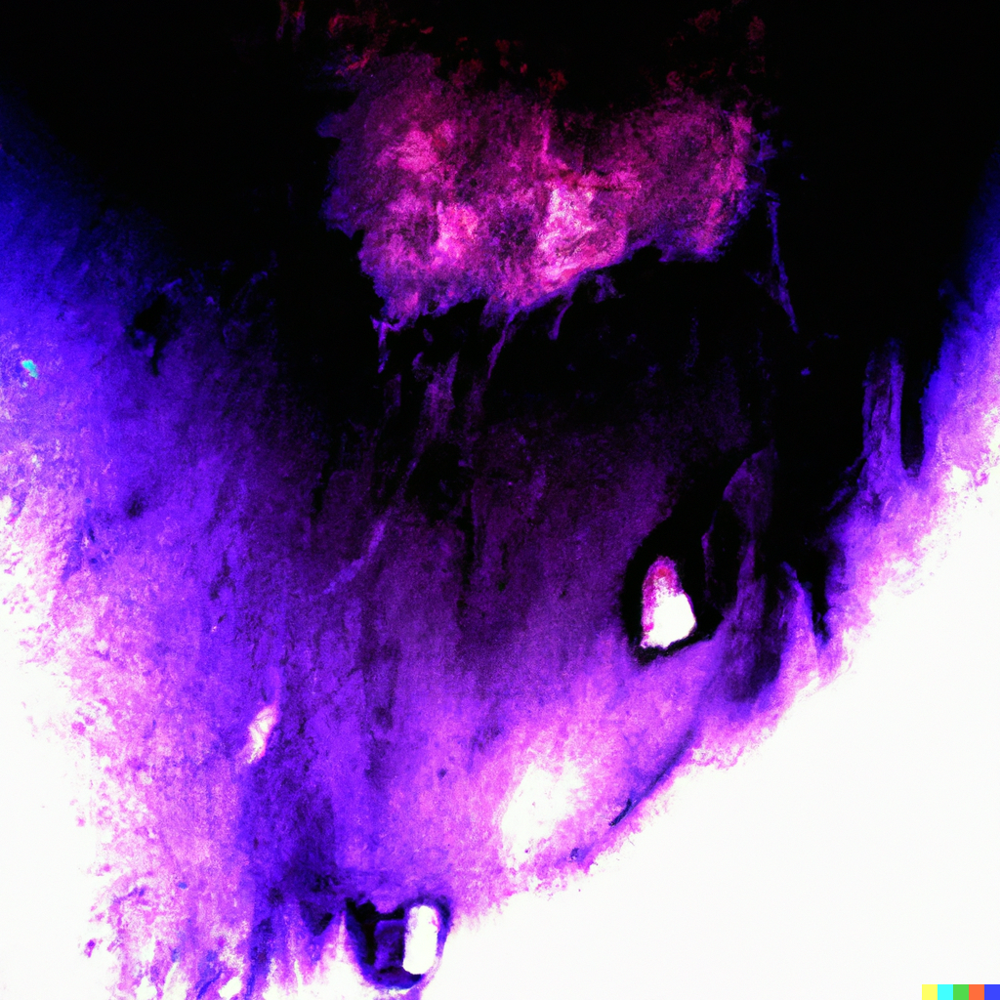
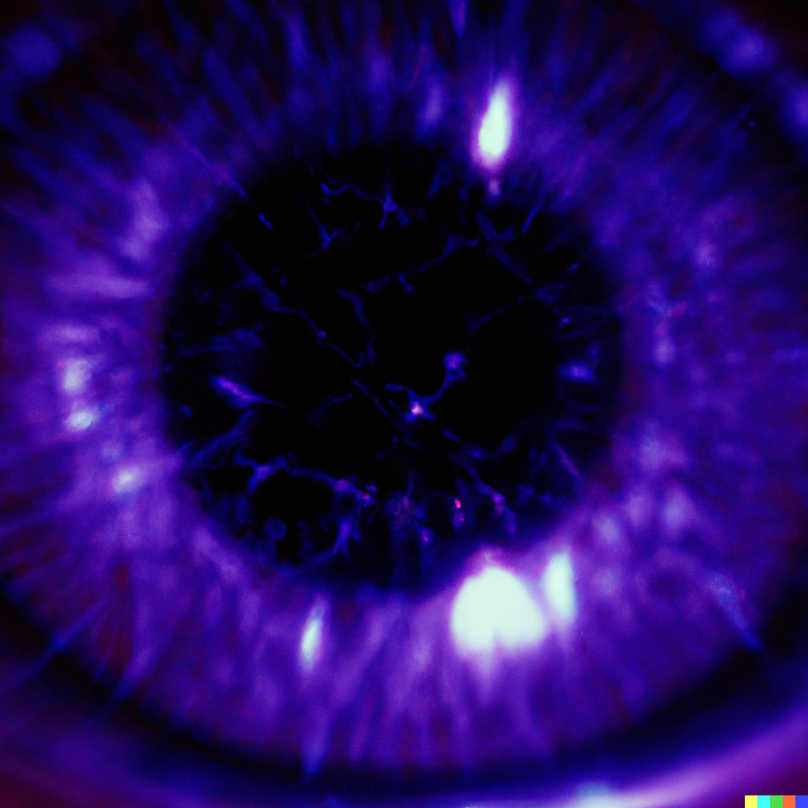
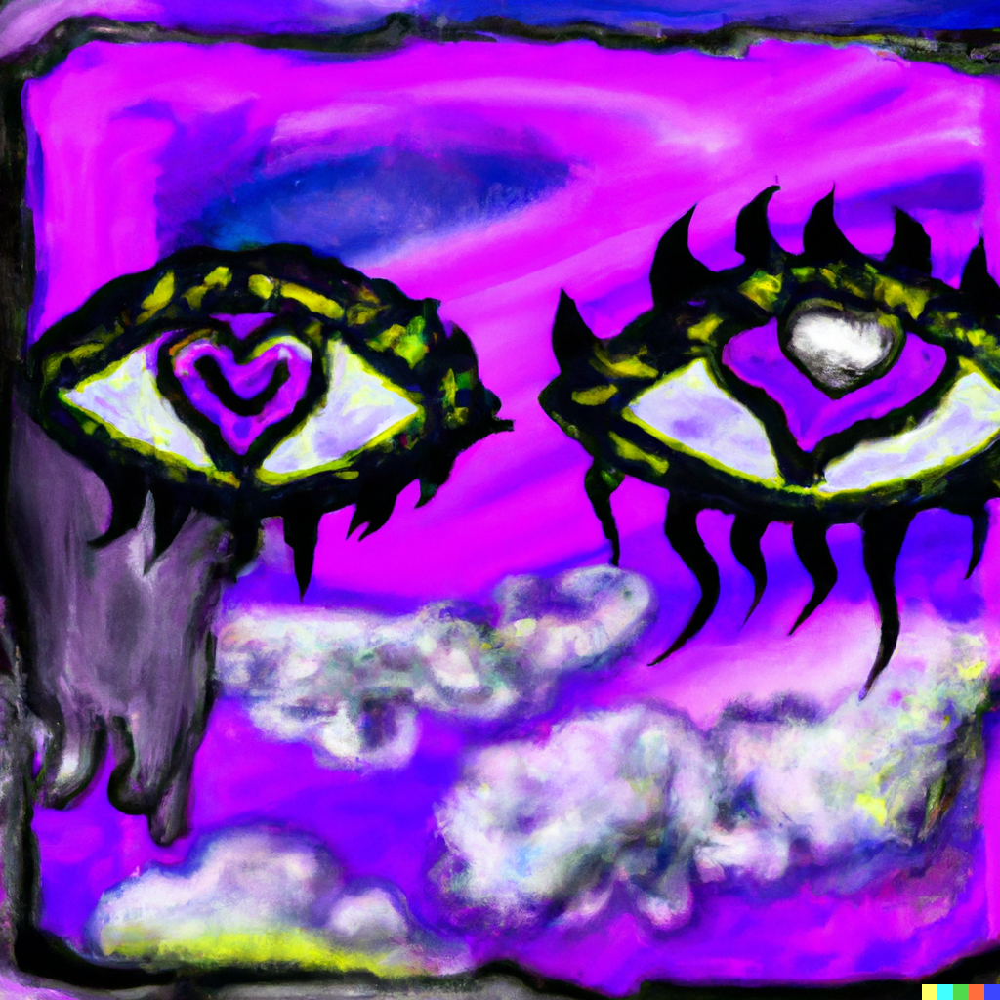

# Step 6

Note: la
Chakra: Third eye (https://www.notion.so/Third-eye-cea7aad31bfe4582939f1da728616062?pvs=21)
Mantra: AUM
Aura: violet
Element: Æther (https://www.notion.so/ther-49fa62581f364b97b0b7bdcf53411bc2?pvs=21)
Bagua: Qian ☰ Heaven (https://www.notion.so/Qian-Heaven-c26ec07282bb445eabe1928c38a8eb1c?pvs=21)
Sense: https://www.notion.so/4d3ae81e814e44c9a68e6de9ac6a7784, https://www.notion.so/7e8ce75dc9d446f38919e24862554889, https://www.notion.so/b85b5d97538540808a34cba452fb9d17
Hermetic Principle: Correspondence (https://www.notion.so/Correspondence-8239de112d8f4c82b2b948270a04610e?pvs=21)
Loveforms: Philautia (https://www.notion.so/Philautia-086bc5cb64584ea79c07a24b641d09e9?pvs=21)
Loveform (Greek): φιλαυτία
Intent: envision
Numerology: action
Theme: intuition
Quality: eternity
Aspect: choice
Act: think
Modes of Persuasion: kairos, logos
Money stage: https://www.notion.so/b32f3f5e556d41b29904d446775dc760
Order: 7
Changes Above: https://www.notion.so/098cabd67313442ba0630ac52adab0a1, https://www.notion.so/34b5247fb31b4ae8bad4ae3a525dac09, https://www.notion.so/460a3415f5ad4024b6b5646417704bec, https://www.notion.so/620b40be921b46228767ae7fc9fe86fa, https://www.notion.so/ad34b9b9edf54af4b44fdddb1bb6b278, https://www.notion.so/bb7c9ef44db744d0b1a7642e41fe098a, https://www.notion.so/df4d529bf03d4dcab1d605bced7b19d3, https://www.notion.so/fe50edfbceb54629b8dac419a95ddd81
Changes Below: https://www.notion.so/09ce559c44b44883bc1f63e82f962a5e, https://www.notion.so/2347bb7df3d64e3c8fc135ee1b13c942, https://www.notion.so/8d1ef033320646c4978f55d1bbb7ef65, https://www.notion.so/a76f63735d81407190ab2b298f2f5c81, https://www.notion.so/ad34b9b9edf54af4b44fdddb1bb6b278, https://www.notion.so/df638efa907f4957ad38ec629412ed80, https://www.notion.so/ecf6888ebb20403eab93967d04cfbd1d, https://www.notion.so/fac35d033f864545b83a7bf3b94002a8
Major Arcana: The Star (https://www.notion.so/The-Star-ea0986dd95c145ce847e32dcf4955e49?pvs=21), The Moon (https://www.notion.so/The-Moon-09ccb24e0d684358aadbbcd7a4897c0f?pvs=21)
Tarot Astrological Entities: https://www.notion.so/ee3fe209dfb54d839cd318d6f671850d,https://www.notion.so/15bb7847ef2c4dde8f825132834304fc
Tarot Elements: Air,Water
Tarot Themes: hope, optimism, trust, direction,shadows, illusion, unseen, subconscious
Dimension: 5-D (https://www.notion.so/5-D-3e3578b42148426a958a61f71a338603?pvs=21)
Diment: scape
Realm: soul
Early Season: Summer
Early Direction: South
Later Season: Autumn,Winter
Late Direction: Northwest
Stories of Deep Well: Anu, Chapter 7 (https://www.notion.so/Anu-Chapter-7-d63aea97f5e5421ab6913512d2ae224a?pvs=21), Oli, Chapter 7 (https://www.notion.so/Oli-Chapter-7-617bf3bf6e3146aaafcc1c55aac71279?pvs=21), Sol, Chapter 7 (https://www.notion.so/Sol-Chapter-7-20fe0bb290d34de199be516e5e37a582?pvs=21)
Previous step: Step 5 (Step%205%20ad67951735a34009b12e2edf3cd65a32.md)
Next step: Step 7 (Step%207%2027d1695c3849469986817447da4a0027.md)
Dimensional Trinities: Creation (https://www.notion.so/Creation-1a52ddb8813980bc8d82f02f3b2ef11a?pvs=21)
Rollup: https://www.notion.so/cea7aad31bfe4582939f1da728616062
Sacred Bodies: Atman body (https://www.notion.so/Atman-body-1a52ddb881398039b765c5b85eeb0083?pvs=21)
Timespace: Eta η time (https://www.notion.so/Eta-time-107c6d0ffe2d414bb4b9732c84af6f55?pvs=21)
Vedic direction: Zenith
Vedic pantheon: Brahma (https://www.notion.so/Brahma-bd3dc97b8a7a46bba4240a7bdde1f60a?pvs=21)

- Contents
    
    

> 🌰 **In a nutshell**
> 

## Poetics

Eyes roll back in head
to peer into the inky well
brimming with oozy moonlight
where intuition pools purple.

Come to focus on the center
heart pulsing hypnotically
face drawn, slight grin
body slack, stacked as a seat.

Time slows to nil
forever beckoning
the self we wear
to love the self we share.

Will what you will to be;
conjure in cold fire and
crystallize the eternal
whys behind your eyes.

Spraypaint your future 
with rancid, sputtering hope
or write your story longhand 
in thick irony, permanent ink.

## Aesthetics

- smooth, inky, purple iridescence; pools of mercurial blood, untouched, unspilled
- flecks and sparks born of shadows; velvety fireworks seeping into view

## Theatrics

- Palpable, casual clairvoyance
- Technological vs. natural telepathy
- Prescient dreams
- Dreams that alter the past
- Seeing the solution in a dream
- Seeing other places and times in reflections

> **🦆 Qualities**
> 

## Narrator

A deep seer, sailor of the seas within, spinner of salty old yarns, teller of tales to come. Unreliable but credulous.

## Tone

- Ambiguous, poetic, murky and dreamy
- Hopeless and sure, lacking optimism and pessimism
- Ethereal, shifting, uncertain

## Themes

- Silicarbonian evolution
- The [Tao](https://www.notion.so/Tao-b0261f89407948f780f8e9be0f0d66c1?pvs=21), correspondence
- Truth and knowing
- Sleep, and the unseen
- Nested dreams
- [Dreaming Awake At The End Of Time: on Terence McKenna](https://www.notion.so/Dreaming-Awake-At-The-End-Of-Time-on-Terence-McKenna-aa9505ee8c424aa2ab50eb3f850c7292?pvs=21)
- [A Dream I Had](https://www.notion.so/A-Dream-I-Had-2c2e118830704ce199d0e7c4a17132d2?pvs=21)
- [Dreams](https://www.notion.so/Dreams-d4f58fe59318489cb79a7362fd9acc0d?pvs=21)
- [Dreamt Of A Wreck](https://www.notion.so/Dreamt-Of-A-Wreck-677547acee3e4f408ac191125a5af743?pvs=21)
- [Dreamliner](https://www.notion.so/Dreamliner-84968e9b6c744153b35b5524431569a6?pvs=21)
- [As Within So Without](https://www.notion.so/As-Within-So-Without-c6b1170ad73045f882e2217065c95f63?pvs=21)
- [We And Nature Are Within Each Other](https://www.notion.so/We-And-Nature-Are-Within-Each-Other-34e70c8f8c1648ab9a6c82e2ef7e7732?pvs=21)
- [Journey to the Undersea Mountaintop Within](https://www.notion.so/Journey-to-the-Undersea-Mountaintop-Within-92d03171192449b39c61e2b495d60995?pvs=21)
- [The Truth Is Not For Sale](https://www.notion.so/The-Truth-Is-Not-For-Sale-df3df81ae0bb4fdb96966568c4176a43?pvs=21)
- [The Truth](https://www.notion.so/The-Truth-da145412c9554885896896c86397d9af?pvs=21)
- [Truth](https://www.notion.so/Truth-c77d73eda9954d618ef2563ddb8ac3ec?pvs=21)
- [Daoism](https://www.notion.so/Daoism-1c3cd00d54854251b44961a22671a4eb?pvs=21)
- [Examples of Technological Devolution](https://www.notion.so/Examples-of-Technological-Devolution-45800270e0964884b66dc3552c55c8b5?pvs=21)

## Symbols ☯️🧿🪬

- Distorted reflections
- Detached holograms
- Apparitions and spectres

